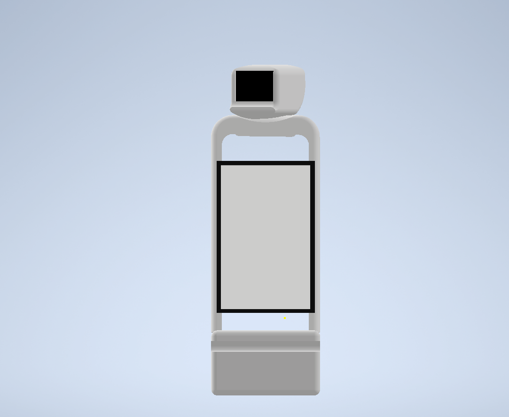
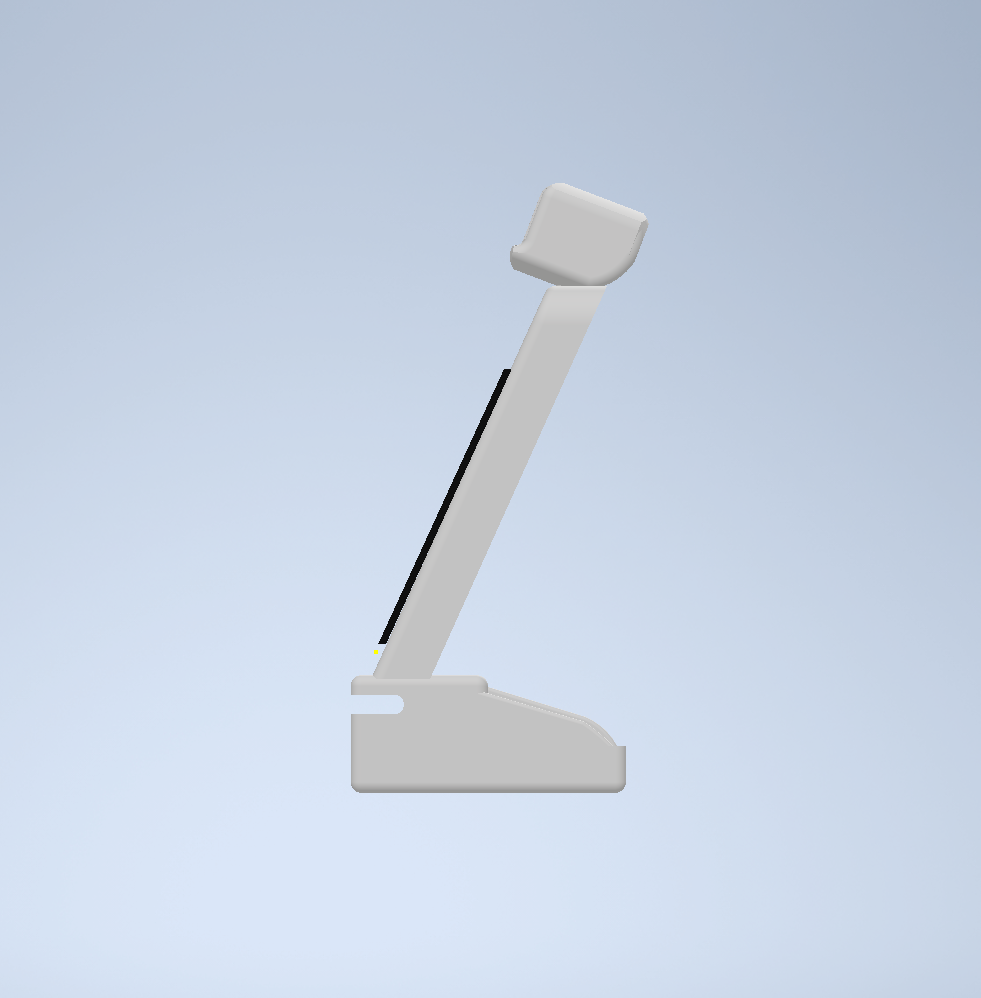
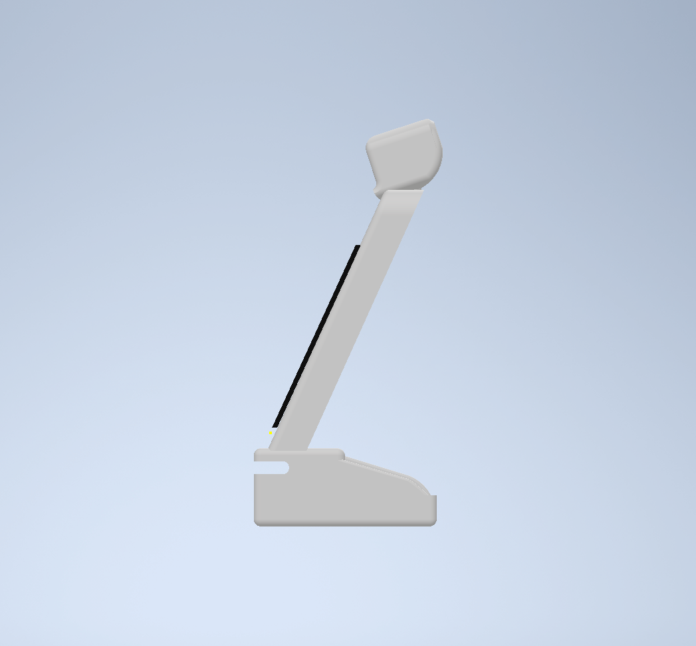

# Neck-joint-of-the-Robot
## Head movement in two axis horizontal and vertical

### (1) Horizontal axis direction

 Rigtht rotate

 Left rotate
 

 ### (2) Vertical axis direction

 UP rotate
     

 down rotate
     
